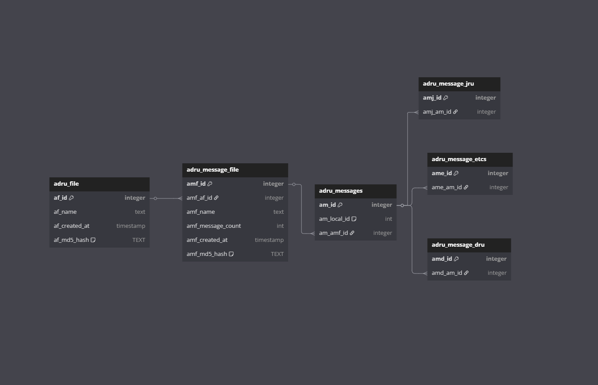

# ADRU Decoder
ADRU decoder works by scanning the adru_raw folder for adru files. It then extracts the messages in these files and add it to a local database.

You can then query the database to get the messages in a readable format. Or add some CSV files to the csv_raw and you can add the missing data to these files by merging the data found in the messages.

The reason for why you might want to extract a custome csv file and import it is so that you can filter and only fetch the data you want. This is not possible in the current version of this exporter/decoder. It fetches all the data no matter what.

## Installation

### Install the requirements:
```bash
pip install -r requirements.txt
```

### Verify that the paths in config.yaml are correct. 

### Then run the ADRU decoder:
```bash
python adru_decoder.py
```

## Usage
You have a menu where you can select scan ADRU files or CSV files. 

The ADRU selection will scan the `adru_raw` folder for adru files and extract the messages. It will then add the messages to a local database.

The CSV selection will scan the `csv_raw` folder for CSV files and merge the data found in the messages with the CSV files. You can then select what ADRU file you want to merge with the CSV file. It will then save the merged data to a new CSV file in the `csv_out` folder.

## Common issues

### ADRU Decoder Subset Error
If you run the ADRU decoder and get this error:
```
Subset is not supported, you need subset 3.0.0 or higher.
```

You most likely have the wrong subSet. Go to the following path:
```
%appdata%\JDRMDR\Configuration03
```

Open the file: **Default.xml**

Locate this line:
```xml
<SUBSET>subset-027_2.3.0\Subset_2.3.0.dll</SUBSET>
```
It might be another subset version. But it will be lower than 3.0.0 we need to update this to use the latest subset version.

Change it to:
```xml
<SUBSET>subset-027_3.3.0\Subset_3.3.0.dll</SUBSET>
```

### CSV Merging Error 
If you run the ADRU decoder and get an error with wrong start byte like:

```bash
  File "parsers.pyx", line 574, in pandas._libs.parsers.TextReader.__cinit__
  File "parsers.pyx", line 663, in pandas._libs.parsers.TextReader._get_header
  File "parsers.pyx", line 874, in pandas._libs.parsers.TextReader._tokenize_rows
  File "parsers.pyx", line 891, in pandas._libs.parsers.TextReader._check_tokenize_status
  File "parsers.pyx", line 2053, in pandas._libs.parsers.raise_parser_error
  File "<frozen codecs>", line 325, in decode
UnicodeDecodeError: 'utf-8' codec can't decode byte 0xb0 in position 1: invalid start byte
```

The reason here is that you might have created the file from EXCEL. And it did not use UTF-8 when creating the document. The fix for this is easy:
1. Open the CSV file in a text editor like Notepad
2. Select "Save As"
3. In the "Encoding" dropdown, select "UTF-8"
4. Save the file
5. Run the ADRU decoder again

It should now work without any issues.

### Database diagram


````db2
// ADRU File Export Database Schema 

Table adru_file {
  af_id integer [primary key, increment]
  af_name text
  af_created_at timestamp
  af_md5_hash TEXT [unique, note: "Uniqe identifier so we know if it allready has been added"]
}

Table adru_message_file {
  amf_id integer [primary key, increment]
  amf_af_id integer
  amf_name text
  amf_message_count int
  amf_created_at timestamp
  amf_md5_hash TEXT [unique, note: "Uniqe identifier so we know if it allready has been added"]
}

Table adru_messages {
  am_id integer [primary key, increment]
  am_local_id int [note: 'This is the id from the MSG annotation in the adru file.']
  am_amf_id integer
}

Table adru_message_jru {
  amj_id integer [primary key, increment]
  amj_am_id integer
}

Table adru_message_etcs {
  ame_id integer [primary key, increment]
  ame_am_id integer
}

Table adru_message_dru {
  amd_id integer [primary key, increment]
  amd_am_id integer
}


Ref: "adru_messages"."am_id" < "adru_message_jru"."amj_am_id"
Ref: "adru_messages"."am_id" < "adru_message_etcs"."ame_am_id"
Ref: "adru_file"."af_id" < "adru_message_file"."amf_af_id"
Ref: "adru_message_file"."amf_id" < "adru_messages"."am_amf_id"

Ref: "adru_messages"."am_id" < "adru_message_dru"."amd_am_id"
````

## Final words
The program have been made to only extract the messages. But have the code needed to enable CSV as well when this is supported. But you will need to do some small updates. As an example now it check if the txt file exist, if it does it to not run through the decoding process, if csv is enabled later and you allready have the txt it will never generate the csv. So you will need to update that logic when csv is enabled as an export.

> Coded by: NorseByte (http://norseroamer.com)